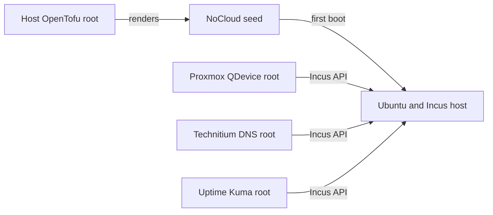

# Micro Node

Micro Node is a PoE-powered Raspberry Pi 5 that runs lightweight services
outside the Proxmox cluster. It keeps core services available when the cluster
is offline.

This directory contains the configuration and steps for a fresh installation.
It does not continuously manage the host after the first boot.

## Dependencies

### Hardware

- Raspberry Pi 5, recommended to have 8GB+ RAM.
- At least 64 GB of storage, such as an SD card or M.2 drive
- A VLAN-aware switch

### Software

- [Raspberry Pi Imager](https://www.raspberrypi.com/software/) to install Ubuntu
- OpenTofu 1.6 or newer to render the host configuration
- `check-jsonschema` and `yamllint` to validate the configuration
- `make` to run the local workflows
- `ssh` and `incus` to manage the installed host

## Quick Start

> [!CAUTION]
> A fresh image erases the boot device, including all Incus instances and storage
> volumes on it. Back up any service data that you need before you continue.

1. Install the software dependencies.

2. Customize infrastructure variables.

   ```bash
   cp terraform.tfvars.example terraform.tfvars
   ```

3. Generate the configuration files.

   ```bash
   make init
   make host-seed
   ```

   This creates `meta-data`, `network-config`, and `user-data` under
   `cloud-init/rendered/`. It validates `user-data` against the Ubuntu 26.04
   [cloud-config schema](https://github.com/canonical/cloud-init/blob/ubuntu/resolute-26.1.x/cloudinit/config/schemas/schema-cloud-config-v1.json)
   and `network-config` against the matching
   [network schema](https://github.com/canonical/cloud-init/blob/ubuntu/resolute-26.1.x/cloudinit/config/schemas/schema-network-config-v2.json).
   It does not connect to the Raspberry Pi or change a running host.

4. Create the boot image.

   Open Raspberry Pi Imager, select **Raspberry Pi 5**, and install
   **Ubuntu Server 26.04 LTS (64-bit)** on the boot device. Skip the Imager OS
   customizations because the rendered seed supplies the user, SSH, hostname,
   and network settings.

   After Imager finishes, remount the `system-boot` partition and replace its
   configuration files with the rendered seed:

   ```bash
   cp cloud-init/rendered/{meta-data,network-config,user-data} <system-boot-mount>/
   ```

5. Configure the network port.

   Configure the Raspberry Pi switch port as a tagged trunk. Allow the
   management and service VLANs, with no native VLAN. The upstream network must
   provide routing and DNS for the host, and DHCP, routing, and DNS for service
   instances.

6. Boot and verify the Raspberry Pi.

   Safely eject the boot device, install it in the Raspberry Pi, connect the
   network uplink, and apply power. The first boot can take several minutes
   while cloud-init installs and configures Incus.

   Connect to the management address from `terraform.tfvars`:

   ```bash
   ssh <admin-user>@<management-address> 'cloud-init status --wait'
   ssh <admin-user>@<management-address> 'incus storage show default >/dev/null && incus network show br0 >/dev/null'
   ```

   The first command must finish with `status: done`. The second command has no
   output when the storage pool and bridge are ready.

## Set Up A Trusted Client

Incus trusts each client certificate separately. Repeat these steps on every
machine that needs to manage the Micro Node.

Create a short-lived token on the Raspberry Pi, then add the Incus remote on the
client:

```bash
ssh <admin-user>@<management-address> 'incus config trust add <client-name>'
incus remote add <remote-name> <one-time-token>
incus list <remote-name>:
```

Compare the certificate fingerprint shown by `incus remote add` with
`incus info` over SSH before you accept it. The token expires after 10 minutes.

The trusted client **should** now be able to deploy the Incus services assigned
to the Micro Node:

- [Proxmox QDevice](../../services/proxmox-qdevice/README.md)
- [Technitium DNS](../../services/technitium-dns/README.md)
- [Uptime Kuma](../../services/uptime-kuma/README.md)

## Architecture

The host and its services have separate lifecycles. This split lets us rebuild
or change one service without mixing its state with the Raspberry Pi bootstrap.



## Troubleshooting

### The Host Has No Management Network

Use the Raspberry Pi console to check cloud-init and the bridge:

```bash
cloud-init status --long
ip -brief address
ip -d link show br0
bridge -compressvlans vlan show
```

Confirm that the switch port carries the management VLAN as tagged traffic and
has no native VLAN.

An image that has booted before can contain
`/etc/cloud/cloud.cfg.d/99-disable-network-config.cfg`. This file prevents
cloud-init from applying `network-config`. A fresh image is the safest fix. If
you must reuse the image, remove the file and reset the cloud-init network state:

```bash
sudo rm -f /etc/cloud/cloud.cfg.d/99-disable-network-config.cfg
sudo cloud-init clean --logs --configs network
```

### Incus Is Not Available

Check whether cloud-init completed, Incus started, and the firewall opened the
management interface:

```bash
journalctl -u cloud-final --no-pager
incus storage show default
incus network show br0
incus config get core.https_address
ss -ltnp
sudo ufw status verbose
systemctl --failed
```

Incus should use the `default` directory pool, see `br0` as unmanaged, and
listen only on the management address.

An HTTP `403` response means that Incus is available but does not trust the
client certificate. Create a new enrollment token and add the remote again.
