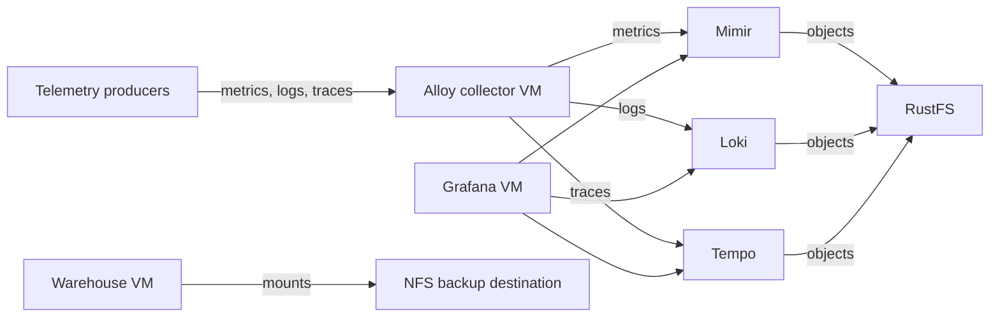

# Observability Warehouse

This OpenTofu root defines the complete telemetry collection, storage, and
visualization service as three protected Debian 13 VMs. Other guest
distributions are not supported:

- The telemetry collector runs Grafana Alloy on `compute`, installed from
  Grafana's APT repository. It accepts
  Prometheus remote write, Loki push, and OTLP traffic and forwards each signal
  to the warehouse.
- The warehouse runs Grafana Mimir, Loki, and Tempo on `store` with Docker
  Compose. Grafana queries these backends, and RustFS stores durable telemetry
  blocks.
- Grafana runs on `compute`, installed from Grafana's APT repository. Its
  provisioned Mimir, Loki, and Tempo data sources point at the warehouse VM.

The components remain separate VMs because they have different resource,
persistence, and failure boundaries. They share one OpenTofu root and state
because the collector and Grafana configurations are specific to these
warehouse backends.

An NFS export is mounted at `/mnt/warehouse` as a backup destination. This root
does not invent a backup schedule or perform an unsafe live copy of object-store
data.

## Dependencies

- All configured target nodes must belong to the same Proxmox cluster.
- A reviewed Debian 13 `debian13` template must exist in the [image catalogue].
  All three VMs clone this template.
- Each target node needs the configured bridge, VM datastore, and a datastore
  with snippets enabled.
- Proxmox must be able to full-clone the source template to each target
  datastore. Cluster membership does not make node-local storage shared.
- DHCP, routing, and any configured VLANs must cover all three VMs.
- A RustFS S3 endpoint and three existing buckets for Mimir, Loki, and Tempo.
- An NFS export reachable from the warehouse VM.
- OpenTofu 1.6 or newer, `make`, `yamllint`, and an Alloy binary matching the
  configured package version.
- A least-privilege Proxmox API token and a PAM user with an SSH private key
  that can access every target node for uploading cloud-init snippets.
- A `proxmox_nodes` entry for each target node. Each entry supplies the explicit
  SSH address, snippet datastore, VM datastore, and bridge used on that node.

Grafana Alloy is installed from Grafana's signed APT repository. First boot
verifies the repository key fingerprint and installs the exact `alloy_version`,
which defaults to `1.18.1-1`. The repository definition follows Grafana's
[Alloy Linux installation] instructions.

Grafana OSS uses the same signed repository and key verification described in
the [Grafana Debian installation] instructions. First boot
installs the exact `grafana_version`, which defaults to `13.1.1`, provisions the
warehouse data sources, and generates an initial administrator password inside
the guest. The password does not enter OpenTofu state.

## Quick Start

1. Create the ignored local configuration.

   ```bash
   cp terraform.tfvars.example terraform.tfvars
   ```

   Assign every required value. Set `template_vm_id` to the image catalogue's
   Debian 13 template and `template_node_name` to the node that hosts it. All
   clone blocks identify this source node explicitly, so the template may live
   on a different node than a target VM. Use distinct cluster-wide IDs for
   `warehouse_vm_id`, `collector_vm_id`, and `grafana_vm_id`. Reserve stable
   DHCP leases for all three VMs. The defaults keep the warehouse on `store`
   and the collector and Grafana on `compute`. Host-independent template, VLAN,
   cloud-user, and SSH-key values are shared. Define each target node once in
   `proxmox_nodes`; the provider generates its SSH mappings from that map. Set
   the API token, PAM SSH username, and private-key path using the same provider
   contract as the image catalogue. The
   ignored variable file contains the API token and node addresses in plaintext
   and must remain readable only by its owner; keep the private key outside this
   repository.

2. Initialize, validate, and review a saved plan.

   ```bash
   make init
   make validate
   make plan
   tofu show deployment.tfplan
   ```

3. Apply only the reviewed plan and inspect all VM outputs.

   ```bash
   make apply
   tofu output -json warehouse_ipv4_addresses
   tofu output -json collector_ipv4_addresses
   tofu output -json grafana_ipv4_addresses
   ```

4. In RustFS, create the configured Mimir, Loki, and Tempo buckets and grant one
   service identity access only to those buckets. Install its credentials in the
   warehouse VM without passing them through OpenTofu state:

   ```bash
   ssh <cloud-user>@<warehouse-address>
   sudo install -m 0600 -o root -g root /etc/observability-warehouse/object-storage.env.example /etc/observability-warehouse/object-storage.env
   sudoedit /etc/observability-warehouse/object-storage.env
   sudo systemctl start observability-warehouse
   ```

5. Retrieve Grafana's guest-generated initial password over SSH, sign in as
   `admin`, and change the password immediately:

   ```bash
   ssh <cloud-user>@<grafana-address>
   sudo sed -n 's/^GF_SECURITY_ADMIN_PASSWORD=//p' /etc/grafana/grafana-admin.env
   ```

   Restrict the root-owned seed file to administrators. Changing the password
   in Grafana updates its database; it does not rewrite this first-boot file.

OpenTofu state is local, may contain private infrastructure data, and must be
backed up securely.

## Node Placement

`proxmox_nodes` is keyed by the node names shown in Proxmox. Each role's
`*_node_name` value must match one of those keys. The default layout uses
`store` for the warehouse and `compute` for the collector and Grafana.

For a one-node deployment, define one map entry and point all three roles at it:

```hcl
proxmox_nodes = {
  "<node-name>" = {
    ssh_address          = "<node-address>"
    snippet_datastore_id = "<snippet-datastore>"
    vm_datastore_id      = "<vm-datastore>"
    vm_bridge            = "<bridge>"
  }
}

warehouse_node_name = "<node-name>"
collector_node_name = "<node-name>"
grafana_node_name   = "<node-name>"
```

Removing a node entry is safe only after no role selects it. A node placement
change is a migration or replacement decision and must be reviewed in the saved
plan.

## Existing Collector Migration

An existing collector must be adopted into this root before applying the
consolidated configuration. First merge its ID and resource values into the
corresponding `collector_*` inputs, its host values into the selected
`proxmox_nodes` entry, and retain `alloy_version`.
The consolidated root discovers the warehouse address from its QEMU guest
agent. Back up both local state files, initialize this root, and import the
existing collector resources:

```bash
tofu import proxmox_virtual_environment_file.collector_cloud_init '<collector-node>/<snippet-datastore>:snippets/telemetry-collector.cloud-config.yaml'
tofu import proxmox_virtual_environment_vm.telemetry_collector '<collector-node>/<collector-vm-id>'
tofu plan
```

Do not continue if the plan proposes creating, replacing, or destroying either
collector resource. After the destination state shows the existing resources
as managed and the plan is safe, remove only their old state bindings from the
retired root:

```bash
tofu -chdir=../telemetry-collector state rm proxmox_virtual_environment_file.cloud_init
tofu -chdir=../telemetry-collector state rm proxmox_virtual_environment_vm.telemetry_collector
```

State removal does not destroy the VM or snippet. Retain the state backups until
the consolidated root has completed a successful refresh and apply.

## Data Flow

| Signal | Collector input | Warehouse output |
| --- | --- | --- |
| Prometheus metrics | `http://<collector>:9090/api/v1/metrics/write` | Mimir `:9009/api/v1/push` |
| Loki logs | `http://<collector>:3100/loki/api/v1/push` | Loki `:3100/loki/api/v1/push` |
| OTLP metrics | gRPC `:4317` or HTTP `:4318/v1/metrics` | Converted to Prometheus and sent to Mimir |
| OTLP logs | gRPC `:4317` or HTTP `:4318/v1/logs` | Converted to Loki entries and sent to Loki |
| OTLP traces | gRPC `:4317` or HTTP `:4318/v1/traces` | Tempo OTLP/gRPC `:4317` |

OTLP log conversion promotes `service.name`, `service.namespace`,
`deployment.environment.name`, and `host.name` to Loki labels. Other attributes
remain in the converted entry rather than becoming high-cardinality labels.
The Prometheus conversion requires cumulative OTLP metrics; delta-temporality
metrics are dropped by Alloy's generally available converter.

Alloy uses the warehouse VM's private IPv4 address reported by the QEMU guest
agent. Grafana and administrative clients use that address as well:

| Caller | Purpose | Endpoint |
| --- | --- | --- |
| Alloy | Prometheus remote write | `http://<warehouse>:9009/api/v1/push` |
| Alloy | Loki write API | `http://<warehouse>:3100/loki/api/v1/push` |
| Alloy | OTLP gRPC | `<warehouse>:4317` |
| Grafana | Prometheus data source | `http://<warehouse>:9009/prometheus` |
| Grafana | Loki data source | `http://<warehouse>:3100` |
| Grafana | Tempo data source | `http://<warehouse>:3200` |

## Architecture



Mimir, Loki, and Tempo run as pinned, monolithic containers. Local Docker
volumes hold WALs, indexes, caches, and compaction work; durable telemetry
blocks live in RustFS. Alloy stores its WAL and working data under
`/var/lib/alloy`. It retains unsent Prometheus samples for no more than eight
hours; prolonged warehouse outages, restarts, or collector loss can drop logs,
traces, and unshipped metrics.

OpenTofu matches the warehouse VM's configured NIC MAC address to the
guest-agent interface data and renders that interface's IPv4 address into the
collector and Grafana first-boot configurations. This orders their provisioning
after warehouse address discovery and excludes loopback and guest-only
interfaces. Keep the warehouse DHCP lease stable: updating uploaded cloud-init
snippets does not rewrite an existing guest's application configuration.

All three VMs are protected against deletion through Proxmox's `protection` flag.
Protection is not a backup and must be disabled deliberately before destroy.
Each component is a single VM on one node. Cluster membership does not provide
service HA, replication, cross-node startup ordering, or automatic failover.

## Security

The collector and warehouse use plaintext, unauthenticated protocols on their
private network. Restrict collector ports `9090`, `3100`, `4317`, and `4318` to
approved telemetry producers. Restrict warehouse ingestion ports to the
collector and warehouse query ports to Grafana and approved administrators. Do
not expose these VMs to an untrusted network. Restrict Grafana's plaintext HTTP
port `3000` to approved users or a trusted reverse proxy.

The Alloy administration server listens only on `127.0.0.1:12345`. Application
credentials are not rendered into cloud-init. RustFS credentials are enrolled
after deployment in a root-owned file on the warehouse VM. Grafana's initial
administrator password is generated in the guest and stored in a root-owned
file rather than OpenTofu state.

## Backup Boundary

Copying live Mimir, Loki, or Tempo working directories does not produce a
reliable backup of RustFS. Back up or replicate the three RustFS buckets with
storage-native tooling that preserves object versions and deletion markers,
then use `/mnt/warehouse` as its destination. Test a restore into empty buckets.

If NFS and RustFS reside on the same storage host, that copy does not protect
against loss of the host or its storage pool. Maintain another fault domain for
irreplaceable telemetry. The collector is not a system of record; include it in
Proxmox backups only if retaining short-lived buffers matters.

Grafana stores users, UI-managed dashboards, alerting state, plugins, and its
SQLite database under `/var/lib/grafana` on the VM disk. S3 is not a Grafana
database, and placing live SQLite on NFS risks locking and corruption. Back up
the Grafana VM through Proxmox if that state must survive guest loss or
replacement. The provisioned data sources are recreated from this repository.

## Operations

Check the warehouse:

```bash
sudo systemctl status observability-warehouse
sudo docker compose --file /opt/observability-warehouse/compose.yaml ps
sudo docker compose --file /opt/observability-warehouse/compose.yaml logs --tail=200 <mimir|loki|tempo>
```

Check and reload Alloy on the collector:

```bash
sudo systemctl status alloy
sudo journalctl -u alloy
sudo bash -c 'set -a; . /etc/default/alloy; set +a; alloy validate /etc/alloy/config.alloy'
sudo systemctl reload alloy
curl --fail http://127.0.0.1:12345/-/ready
```

The validation command above uses Debian's APT package environment path.

Check Grafana:

```bash
sudo systemctl status grafana-server
sudo journalctl -u grafana-server
curl --fail http://127.0.0.1:3000/api/health
```

Upgrade one pinned component at a time after reviewing release notes and backup
status. Update `config/compose.yaml` for warehouse images, `alloy_version` for
the collector, or `grafana_version` for Grafana. Cloud-init changes update
uploaded snippets but do not reconfigure existing VMs; apply equivalent changes
in the guest or replace the affected VM after reviewing the plan. Replacement
discards that VM's local state and causes a component-specific interruption. A
Grafana replacement also discards users and UI-managed dashboards unless they
are restored from backup.

## Troubleshooting

Check first boot and guest address discovery on the affected VM:

```bash
sudo cloud-init status --long
sudo journalctl -u cloud-final
sudo systemctl status qemu-guest-agent
```

For warehouse failures, inspect `observability-warehouse`, the Compose config,
the NFS mount, bucket existence, RustFS connectivity, and the root-owned
credential file. For collector write failures, validate Alloy and verify
routing, firewall rules, the discovered warehouse address, and warehouse
readiness endpoints. For Grafana failures, inspect `grafana-server`, its local
health endpoint, `/etc/grafana/provisioning/datasources`, and connectivity to
the warehouse query ports. For a failed cross-node clone, confirm the source
template location and that Proxmox can copy its disks to the selected target
datastore, and confirm that the configured template is the catalogue's Debian
13 image. For a snippet transfer failure, verify the selected `proxmox_nodes`
entry, SSH agent or private key, PAM username, and target snippet datastore.

[image catalogue]: ../image-catalogue/README.md
[Alloy Linux installation]: https://grafana.com/docs/alloy/latest/set-up/install/linux/
[Grafana Debian installation]: https://grafana.com/docs/grafana/latest/setup-grafana/installation/debian/
