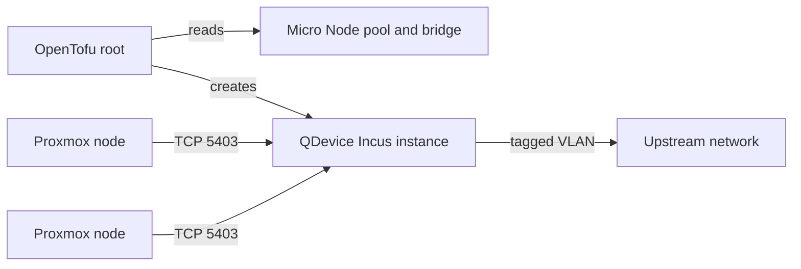

# Proxmox QDevice

Proxmox QDevice gives an even-sized Proxmox cluster an external quorum vote.
This OpenTofu root deploys `corosync-qnetd` in an Incus instance on the
[Micro Node], outside the Proxmox cluster.

The root manages the QDevice instance and its root SSH keys. Proxmox cluster
enrollment remains a separate, coordinated operation.

## Dependencies

- A prepared [Micro Node] with its `default` directory pool and unmanaged `br0`
  bridge
- A trusted Incus remote on the management workstation
- DHCP, routing, and DNS on the QDevice VLAN
- A stable DHCP reservation or DNS record for the QDevice
- OpenTofu 1.6 or newer, `make`, and `yamllint`
- TCP `5403` from every Proxmox node and TCP `22` from the setup node

## Quick Start

> [!CAUTION]
> QDevice removal or replacement can change quorum. Confirm that all Proxmox
> nodes are healthy and review the expected votes before changing the instance.

1. Create the local configuration.

   ```bash
   cp terraform.tfvars.example terraform.tfvars
   ```

   Set the trusted Incus remote, VLAN, and Proxmox root public keys. Replace all
   key placeholders; planning rejects them before it can create the instance.

2. Initialize and validate the root.

   ```bash
   make init
   make validate
   ```

3. Create and review a saved plan.

   ```bash
   make plan
   tofu show deployment.tfplan
   ```

   Planning contacts the Incus host and confirms that its storage pool and
   bridge match the expected Micro Node configuration.

4. Apply the reviewed plan and record its stable address.

   ```bash
   make apply
   tofu output -raw ipv4_address
   ```

5. Install the QDevice client on every Proxmox node.

   ```bash
   apt install corosync-qdevice
   ```

6. Run setup from a Proxmox node whose root public key is in
   `root_authorized_keys`.

   ```bash
   pvecm qdevice setup <qdevice-address>
   pvecm status
   ```

   Verify that the cluster is quorate, the expected vote count is correct, and
   the QDevice is healthy rather than `NA`.

## Architecture



The instance uses 1 vCPU and 256 MiB of memory. It has no Incus profile and
joins the configured VLAN through `br0`. Cloud-init installs OpenSSH and
`corosync-qnetd`, disables password authentication, and enables root login with
public keys only.

OpenTofu rewrites `/root/.ssh/authorized_keys` when `root_authorized_keys`
changes. It does not detect manual edits made inside the instance. SSH remains
available after setup unless upstream firewall policy blocks it.

OpenTofu uses local state in this directory. State and saved plans are ignored
by Git and can contain the configured public keys. Back up state and handle plan
files as environment-specific data.

## Replacement

The QDevice certificate database lives on the instance root disk and does not
survive replacement. Coordinate replacement with the Proxmox cluster:

1. Confirm that all Proxmox nodes are healthy and that removing the external
   vote will not lose quorum.
2. Remove the current QDevice with `pvecm qdevice remove`.
3. Apply the reviewed OpenTofu replacement.
4. Run `pvecm qdevice setup <qdevice-address>` again.
5. Verify votes and QDevice health with `pvecm status`.

Remove the QDevice before changing cluster membership. Configure it again only
after the cluster returns to an even node count.

To adopt an existing instance, use its actual image in the import ID:

```bash
tofu import 'incus_instance.proxmox_qdevice' 'default/proxmox-qdevice,image=images:debian/13/cloud'
make plan
```

Import does not run cloud-init. The imported instance must already have a
working `corosync-qnetd` installation.

## Troubleshooting

Check the instance, cloud-init, and QDevice service:

```bash
incus config show <remote-name>:proxmox-qdevice
incus exec <remote-name>:proxmox-qdevice -- cloud-init status --long
incus exec <remote-name>:proxmox-qdevice -- systemctl status corosync-qnetd --no-pager
```

If `pvecm status` reports the QDevice as `NA`, verify its stable address and TCP
`5403` connectivity from every Proxmox node. TCP `22` must also be reachable
from the node that runs `pvecm qdevice setup`.

Changing `cloud-init.user-data` does not rerun cloud-init on an existing
instance. Use a coordinated replacement when first-boot provisioning must run
again.

[Micro Node]: ../../hosts/micro-node/README.md
