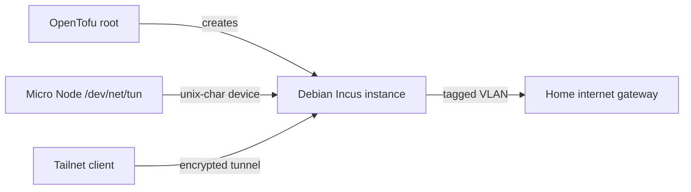

# Tailscale Exit Node

This OpenTofu root deploys a Tailscale exit node in an Incus instance on the
[Micro Node]. It provides remote tailnet clients with an internet egress point
through the homelab network.

The root manages the instance, TUN device, kernel forwarding, and Tailscale
installation. Tailnet authentication, exit-node approval, access policy, and
client selection remain operator-managed.

## Dependencies

- A prepared [Micro Node] with its `default` directory pool, unmanaged `br0`
  bridge, and host `/dev/net/tun` device
- A trusted Incus remote on the management workstation
- DHCP, routing, and DNS on the service VLAN
- Outbound HTTPS and UDP access required by Tailscale
- A Tailscale tailnet and permission to add and approve an exit node
- OpenTofu 1.6 or newer, `make`, and `yamllint`

## Quick Start

1. Create the local configuration.

   ```bash
   cp terraform.tfvars.example terraform.tfvars
   ```

   Set `incus_remote` to the trusted Micro Node remote and select the service
   VLAN. Reserve a stable DHCP lease if operators need a predictable LAN address
   for troubleshooting.

2. Initialize and validate the root.

   ```bash
   make init
   make validate
   ```

3. Create and review a saved plan.

   ```bash
   make plan
   tofu show deployment.tfplan
   ```

   Planning contacts the Incus host and confirms that its storage pool and
   bridge match the expected Micro Node configuration.

4. Apply the reviewed plan.

   ```bash
   make apply
   tofu output -raw ipv4_address
   ```

   OpenTofu waits for cloud-init and verifies that `/dev/net/tun`, IPv4
   forwarding, and `tailscaled` are ready.

5. Authenticate the instance and advertise it as an exit node.

   ```bash
   incus exec <remote-name>:tailscale-exit-node -- tailscale up --advertise-exit-node
   ```

   Follow the displayed login URL. Keeping authentication outside OpenTofu
   prevents an auth key from being retained in state and Incus configuration.

6. In the Tailscale admin console, approve **Use as exit node** for the new
   machine. If the tailnet uses a custom access policy, grant the intended users
   access to `autogroup:internet`. Disable key expiry for this unattended
   machine, or monitor its expiry and reauthenticate it before that date. Then
   select this exit node on a client.

## Architecture



The instance uses 1 vCPU and 256 MiB of memory, has no Incus profile, and joins
the configured VLAN through `br0`. DHCPv6 is disabled on the service NIC. Incus
enables IPv4 and IPv6 forwarding for Tailscale's exit routes and passes through
the host TUN device required by Tailscale.

Cloud-init runs Tailscale's current installation script. The script and
installed release are not pinned by this repository, so a fresh deployment can
change without an OpenTofu change. Deployment requires working access to Debian
package repositories and `tailscale.com`.

Tailscale identity and preferences live on the instance root disk. Replacing
the instance creates a new tailnet machine that must be authenticated and
approved again. Remove the old machine from the Tailscale admin console after a
replacement.

OpenTofu uses local state in this directory. State is ignored by Git and must be
backed up with the rest of the operator's infrastructure state.

## Operations

Check daemon and tailnet status:

```bash
incus exec <remote-name>:tailscale-exit-node -- systemctl status tailscaled --no-pager
incus exec <remote-name>:tailscale-exit-node -- tailscale status
```

Re-advertise the exit-node routes without changing other preferences:

```bash
incus exec <remote-name>:tailscale-exit-node -- tailscale set --advertise-exit-node
```

If machine-key expiry remains enabled, reauthenticate when required and confirm
that the exit-node routes are still approved:

```bash
incus exec <remote-name>:tailscale-exit-node -- tailscale up --force-reauth --advertise-exit-node
```

Upgrades are operator-managed. Review Tailscale release notes before upgrading:

```bash
incus exec <remote-name>:tailscale-exit-node -- tailscale update
```

To adopt an existing instance, use its actual image in the import ID:

```bash
tofu import 'incus_instance.tailscale_exit_node' 'default/tailscale-exit-node,image=images:debian/13/cloud'
make plan
```

Import does not install or configure Tailscale. The imported instance must
already provide the expected TUN device, forwarding settings, and daemon.

## Troubleshooting

Check Incus, cloud-init, forwarding, and the TUN device:

```bash
incus config show <remote-name>:tailscale-exit-node --expanded
incus exec <remote-name>:tailscale-exit-node -- cloud-init status --long
incus exec <remote-name>:tailscale-exit-node -- sysctl net.ipv4.ip_forward net.ipv6.conf.all.forwarding
incus exec <remote-name>:tailscale-exit-node -- test -c /dev/net/tun
incus exec <remote-name>:tailscale-exit-node -- journalctl -u tailscaled --no-pager
```

If the machine is connected but unavailable to clients, confirm that it still
advertises exit-node routes, that an administrator approved them, and that the
tailnet policy grants access to `autogroup:internet`. Also confirm that the
service VLAN permits outbound internet access and return traffic.

Changing `cloud-init.user-data` does not rerun cloud-init on an existing
instance. Replace the instance when first-boot provisioning must run again, then
authenticate and approve the new tailnet machine.

[Micro Node]: ../../hosts/micro-node/README.md
