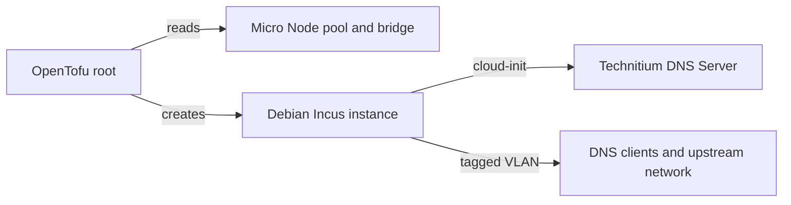

# Technitium DNS

Technitium DNS provides name resolution from outside the Proxmox cluster. This
OpenTofu root deploys one Technitium DNS Server instance on the [Micro Node].

The root manages the Incus instance. DNS zones, forwarding, filtering,
certificates, clustering, and application upgrades remain operator-managed.

## Dependencies

- A prepared [Micro Node] with its `default` directory pool and unmanaged `br0`
  bridge
- A trusted Incus remote on the management workstation
- DHCP, routing, and initial DNS on the service VLAN
- OpenTofu 1.6 or newer, `make`, and `yamllint`
- UDP and TCP `53` from DNS clients, and TCP `5380` from administrators

## Quick Start

> [!CAUTION]
> Technitium configuration is stored on the instance root disk. Replacing the
> instance deletes that configuration. Create and test an application backup
> before any replacement.

1. Create the local configuration.

   ```bash
   cp terraform.tfvars.example terraform.tfvars
   ```

   Set `incus_remote` to the trusted Micro Node remote and select the service
   VLAN. Reserve a stable DHCP lease before configuring DNS clients.

2. Initialize and validate the root.

   ```bash
   make init
   make validate
   ```

3. Create and review a saved plan.

   ```bash
   make plan
   tofu show deployment.tfplan
   ```

   Planning contacts the Incus host and confirms that its storage pool and
   bridge match the expected Micro Node configuration.

4. Apply the reviewed plan.

   ```bash
   make apply
   tofu output -raw ipv4_address
   ```

5. Open `http://<technitium-address>:5380/`, change the administrator password,
   and configure the server. Restrict the administration UI to trusted clients.
   Do not enable Technitium DHCP unless this instance is intended to provide it.

## Architecture



The instance uses 1 vCPU and 512 MiB of memory. It has no Incus profile and
joins the configured VLAN through `br0`. The extra AppArmor rule permits the
.NET runtime to send thread-management signals; without it, Technitium can enter
a repeated `SIGTRAP` loop.

Cloud-init downloads and runs Technitium's current installation script. The
script and installed release are not pinned by this repository, so a fresh
deployment can change without an OpenTofu change. Deployment also requires
working access to Debian package repositories and `download.technitium.com`.

OpenTofu uses local state in this directory. State is ignored by Git and must be
backed up with the rest of the operator's infrastructure state.

## Operations

Use Technitium's backup and restore functions to keep a tested copy of the
server configuration outside the Micro Node. OpenTofu does not manage the files
under `/etc/dns` or apply application upgrades after first boot.

To adopt an existing instance, use its actual image in the import ID:

```bash
tofu import 'incus_instance.technitium_dns' 'default/technitium-dns,image=images:debian/13/cloud'
make plan
```

Omitting `image=...`, or declaring a different image, causes replacement on the
next apply.

## Troubleshooting

Check the instance, cloud-init, and DNS service:

```bash
incus config show <remote-name>:technitium-dns
incus exec <remote-name>:technitium-dns -- cloud-init status --long
incus exec <remote-name>:technitium-dns -- systemctl status dns --no-pager
incus exec <remote-name>:technitium-dns -- journalctl -u dns --no-pager
```

If clients cannot resolve names, confirm the DHCP reservation, VLAN policy, and
both UDP and TCP firewall rules for port `53`.

Changing `cloud-init.user-data` does not rerun cloud-init on an existing
instance. Restore from backup after a reviewed replacement when first-boot
provisioning must run again.

[Micro Node]: ../../hosts/micro-node/README.md
