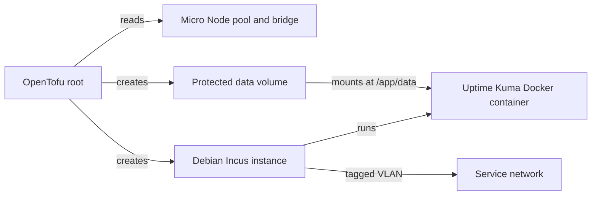

# Uptime Kuma

Uptime Kuma provides availability monitoring from outside the Proxmox cluster.
This OpenTofu root deploys it as a Docker container inside an Incus instance on
the [Micro Node].

The root manages the instance and a separate data volume. It does not manage the
Incus host, application settings, monitors, or ongoing Uptime Kuma upgrades.

## Dependencies

- A prepared [Micro Node] with its `default` directory pool and unmanaged `br0`
  bridge
- A trusted Incus remote on the management workstation
- DHCP, routing, and DNS on the service VLAN
- OpenTofu 1.6 or newer, `make`, and `yamllint`
- Network access from administrators and monitored clients to TCP `3001`

## Quick Start

1. Create the local configuration.

   ```bash
   cp terraform.tfvars.example terraform.tfvars
   ```

   Set `incus_remote` to the trusted Micro Node remote and select the service
   VLAN. Reserve a stable DHCP lease before publishing monitors or status pages.

2. Initialize and validate the root.

   ```bash
   make init
   make validate
   ```

3. Create and review a saved plan.

   ```bash
   make plan
   tofu show deployment.tfplan
   ```

   Planning contacts the Incus host and confirms that its storage pool and
   bridge match the expected Micro Node configuration.

4. Apply the reviewed plan.

   ```bash
   make apply
   tofu output -raw ipv4_address
   ```

   Open `http://<uptime-kuma-address>:3001/` and create the administrator
   account. Restrict access or place the service behind a trusted reverse proxy
   before exposing it outside the administration network.

## Architecture



The instance uses 1 vCPU and 1 GiB of memory. It has no Incus profile and joins
the configured VLAN through `br0`. Cloud-init installs Docker and starts
`louislam/uptime-kuma:2`; OpenTofu waits for a successful local HTTP response
during initial creation.

Application data lives in the `uptime-kuma-data` custom volume. The
`prevent_destroy` rule protects it from accidental OpenTofu deletion, but it is
not a backup. The volume still depends on the Micro Node's local directory pool
and is lost if that storage is erased. Keep tested backups outside the host.

OpenTofu uses local state in this directory. State is ignored by Git and must be
backed up with the rest of the operator's infrastructure state.

## Operations

Update the Uptime Kuma image without replacing the Incus instance:

```bash
incus exec <remote-name>:uptime-kuma -- docker pull louislam/uptime-kuma:2
incus exec <remote-name>:uptime-kuma -- docker rm --force uptime-kuma
incus exec <remote-name>:uptime-kuma -- docker run --detach --restart=unless-stopped --name uptime-kuma --publish=3001:3001 --volume=/var/lib/uptime-kuma:/app/data louislam/uptime-kuma:2
```

The `:2` tag is mutable. Review release notes and take an off-host backup before
each update. OpenTofu does not detect or apply later Docker image releases.

To adopt existing resources, import the volume before the instance. Use the
instance's actual image in the import ID to avoid an unintended replacement.

```bash
tofu import incus_storage_volume.uptime_kuma_data default/default/uptime-kuma-data
tofu import 'incus_instance.uptime_kuma' 'default/uptime-kuma,image=images:debian/13/cloud'
make plan
```

Permanent volume deletion requires a reviewed change that removes
`prevent_destroy`.

## Troubleshooting

Check Incus, cloud-init, Docker, and the local application endpoint:

```bash
incus config show <remote-name>:uptime-kuma
incus storage volume show <remote-name>:default uptime-kuma-data
incus exec <remote-name>:uptime-kuma -- cloud-init status --long
incus exec <remote-name>:uptime-kuma -- docker ps --all
incus exec <remote-name>:uptime-kuma -- curl --fail http://127.0.0.1:3001/
```

Changing `cloud-init.user-data` does not rerun cloud-init on an existing
instance. Replace the instance when first-boot provisioning must run again. The
separate data volume remains protected, but replacement still causes downtime.

[Micro Node]: ../../hosts/micro-node/README.md
